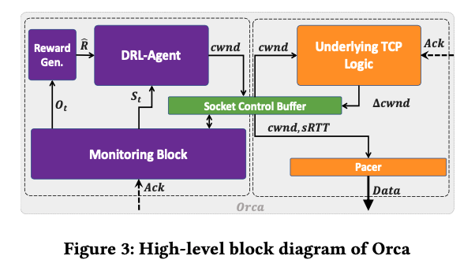
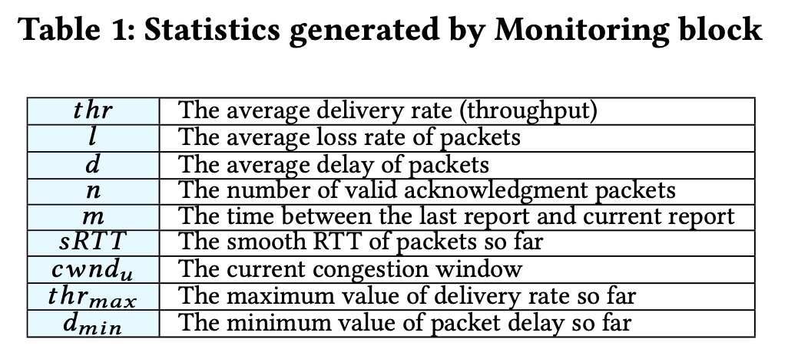
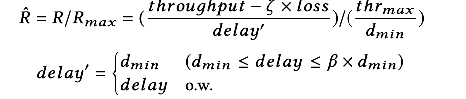

### Classic Meets Modern: a Pragmatic Learning-Based Congestion Control for the Internet 

Date: 2020.9.5

From Sigcomm 2020

### Abstract

Clean-slate learning based techniques issues: overhead, convergence issues, low performance over unseen network conditions.

To address them, this paper propose an approach combines modern & classic: orca.

### Introduction

classic cc only hard-wire predefined events to predefined actions -> lack adaptive CC.

Why learning? Adaptive 

Why not? 

1. Problem with unseen network scenarios

 	2. convergence issue
      	1. wrong equilibrium points
      	2. do not converge or converge slowly
 	3. Overhead -> high CPU utilization 

Why RL&DL? 

1. sequential decision making process -> fits RL
2. Learn high-level features -> DRL has the potential 

Contributions

1. reveal need for practical learning based design
2. develop a novel CC design
3. test in the wild

### Introduction

classic cc only hard-wire predefined events to predefined actions -> lack adaptive CC.

Why learning? Adaptive 

Why not? 

1. Problem with unseen network scenarios

 	2. convergence issue
      	1. wrong equilibrium points
      	2. do not converge or converge slowly
 	3. Overhead -> high CPU utilization 

Why RL&DL? 

1. sequential decision making process -> fits RL
2. Learn high-level features -> DRL has the potential 

Contributions

1. reveal need for practical learning based design
2. develop a novel CC design
3. test in the wild

### System Design overview

1. big picture
   1. Fine-grain control: normal ack based logic
   2. Coarse grain control: every monitoring period, DRL agent monitor the env's statistics, calculate a new condo, enforce it. 

2. benefits of two-level(coarse and fine-grain) control
   1. continuous probing and convergence: add disturbances, 防止收敛到局部最优, [so how to determine the disturbance value?]
   2. predicatable
   3. acceptable overhead
   4. efficient trainng 

### ORCA's Desgin

* monitoring block

  * a shim layer in the Kernel enables us to make the process of gathering required statistics fast and independent of the underlying TCP scheme.

    

  * To feed the values to agent, we will normalize the statistics

    * This helps the agent generalize the network environment -> no further explanation 
    * treat the signals equally

  * Recurrent Structure

    * Problem: different network environments do not necessarily have a Markov property(https://en.wikipedia.org/wiki/Markov_property)

    * no current exact network state, the agent can only infer it as a latent variable from the observed features. Therefore, we aggregate partial information from the past and capture the dependency in the sequential data.

       `m` history of feature vectors -> the final state

* Reward: `Power = throughput / delay`, introduced in 1978, we consider loss rate as well,

  
  * less than the network’s bandwidth -> observe the min `delay`
  * more than the network’s bandwidth -> observe the max `throughput`

* DRL-Agent
  
  * desired outputs:  Congestion window(condo) and pacing rate(cwnd)
  
  * DRL-Agent determines a parameter called **alpha** as the output which relates the final **cwnd** to **cwndu**, it can simplify exploration and consequently lowers the convergence time.
  
  * $$
    cwnd = 2^\alpha \times cwnd_u (-2<\alpha<2)
    $$
  
  * pacing rate
  
  * $$
    p_{rate} = \frac{cwnd}{sRTT}
    $$
  
* Learning the algorithm

  * at time step *t*, agent observes state *s*[t] , selects action *a* with respect to *pi*, receive reward *r=r(s, a)*

    and a new state s[t+1]. 

  * agent's algorithm: DPG, actor critic.
    * actor(w1, w2) will adapt policies, critic(theta) will evaluate actor's actions.

* Distributed Learning

  * Arch : actors, replay memory, learners
  * Actors: sync latest model from learner
  * replay memory: save actor's experience(state, action, reward)
  * Learner: train model, learn from replay memory samples