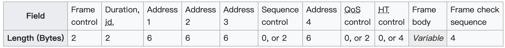

### WiFi notes

---

**General description**:

* a series of [half-duplex](https://en.wikipedia.org/wiki/Half-duplex) over-the-air [modulation](https://en.wikipedia.org/wiki/Modulation) techniques that use the same basic protocol
* employ CSMA/CA whereby equipment listens to a channel for other users (including non 802.11 users) before transmitting each packet.

**History:**

* 802.11-1997, first one.
* 802.11b, widely used one. followed by 802.11a, 802.11g, 802.11n, and 802.11ac
* Other standards are service amendments that are used to extend the current scope of the existing standard

**Categories:**

* 802.11b(2000)
  *  use the 2.4 [GHz](https://en.wikipedia.org/wiki/Hertz) [ISM band](https://en.wikipedia.org/wiki/ISM_band), 
  * maximum raw data rate of 11 Mbps, and 
* 802.11a (1999)
  * uses the [5 GHz U-NII band](https://en.wikipedia.org/wiki/U-NII), max data rate 54Mbps,  plus error correction code, which yields realistic net achievable throughput in the mid-20 Mbps.
  * 802.11a signals are absorbed more readily by walls and other solid objects in their path due to their smaller wavelength.
* 802.11g (2003)
  * uses  the same [OFDM](https://en.wikipedia.org/wiki/Orthogonal_frequency-division_multiplexing) based transmission scheme as 802.11a. 
  * It operates at a maximum physical layer bit rate of 54 Mbit/s exclusive of forward error correction codes, or about 22 Mbit/s average throughput.
  *  By summer 2003, most dual-band 802.11a/b products became dual-band/tri-mode, supporting a and b/g in a single mobile [adapter card](https://en.wikipedia.org/wiki/Adapter_card) or access point. Activity of an 802.11b participant will reduce the data rate of the overall 802.11g network.
  *  802.11g devices also suffer interference from other products operating in the 2.4 GHz band, for example wireless keyboards.
* 802.11n(2009)
  * called WiFi4
  * The standard added support for [multiple-input multiple-output](https://en.wikipedia.org/wiki/Multiple-input_multiple-output) antennas (MIMO). 
  * 802.11n operates on both the 2.4 GHz and the 5 GHz bands. Support for 5 GHz bands is optional.
  * Its net data rate ranges from 54 Mbit/s to 600 Mbit/s. 
* 802.11ac(2013)
  * called WiFi5
  * wider channels (80 or 160 MHz)
  * more spatial streams
  * higher-order modulation (up to 256-[QAM](https://en.wikipedia.org/wiki/Quadrature_amplitude_modulation) vs. 64-QAM)
  * [Multi-user MIMO](https://en.wikipedia.org/wiki/Multi-user_MIMO) (MU-MIMO)

**about throughput**

* maximum achievable throughputs are given either based on measurements under ideal conditions or in the layer-2 data rates.
* True throughput: Typical deployments in which data is being transferred between two endpoints, of which at least one is typically connected to a wired infrastructure and the other endpoint is connected to an infrastructure via a wireless link.

**Channels and frequencies**

* 
* 子信道宽带22MHz，大部分信道之间相互重叠，只有3个信道可以同时使用

**Layer2 Datagrams**

* Mac header

  

* Frame Control 

  * Protocol Version: Two bits representing the protocol version. 
  * Type: Two bits identifying the type of WLAN frame. Control, Data, and Management are various frame types
  * ToDS and FromDS: Each is one bit in size. They indicate whether a data frame is headed for a distribution system. 
  * More Fragments: The More Fragments bit is set when a packet is divided into multiple frames for transmission. Every frame except the last frame of a packet will have this bit set.
  * Retry: Sometimes frames require retransmission, and for this there is a Retry bit that is set to one when a frame is resent.
  * Power Management: This bit indicates the power management state of the sender after the completion of a frame exchange. Access points are required to manage the connection, and will never set the power-saver bit.
  * More Data: The More Data bit is used to buffer frames received in a distributed system. The access point uses this bit to facilitate stations in power-saver mode. It indicates that at least one frame is available, and addresses all stations connected.
  * Protected Frame: The Protected Frame bit is set to one if the frame body is encrypted by a protection mechanism such as [Wired Equivalent Privacy](https://en.wikipedia.org/wiki/Wired_Equivalent_Privacy) (WEP), [Wi-Fi Protected Access](https://en.wikipedia.org/wiki/Wi-Fi_Protected_Access#WPA) (WPA), or [Wi-Fi Protected Access II](https://en.wikipedia.org/wiki/Wi-Fi_Protected_Access#WPA2) (WPA2).
  * Order: This bit is set only when the "strict ordering" delivery method is employed. Frames and fragments are not always sent in order as it causes a transmission performance penalty.

* Duration ID field indicates how long the field's transmission will take so other devices know when the channel will be available again.

* An 802.11 frame can have up to four address fields. Each field can carry a [MAC address](https://en.wikipedia.org/wiki/MAC_address). Address 1 is the receiver, Address 2 is the transmitter, Address 3 is used for filtering purposes by the receiver. Address 4 is only present in data frames transmitted between access points in an [Extended Service Set](https://en.wikipedia.org/wiki/Extended_Service_Set) or between intermediate nodes in a [mesh network](https://en.wikipedia.org/wiki/Mesh_networking).
* The Sequence Control field is a two-byte section used for identifying message order as well as eliminating duplicate frames. The first 4 bits are used for the fragmentation number, and the last 12 bits are the sequence number.
* The Frame Check Sequence (FCS) is the last four bytes in the standard 802.11 frame. Often referred to as the Cyclic Redundancy Check (CRC), it allows for integrity check

**Management Frames**

* Including Authentication frame, Probe request frame, Action frame...

**Control Frames**

* Acknowledgement (ACK) frame: After receiving a data frame, the receiving station will send an ACK frame to the sending station if no errors are found. If the sending station doesn't receive an ACK frame within a predetermined period of time, the sending station will resend the frame.
* Request to Send (RTS) frame: The [RTS and CTS frames](https://en.wikipedia.org/wiki/IEEE_802.11_RTS/CTS) provide an optional collision reduction scheme for access points with hidden stations. A station sends a RTS frame as the first step in a two-way handshake required before sending data frames.
* Clear to Send (CTS) frame: A station responds to an RTS frame with a CTS frame. It provides clearance for the requesting station to send a data frame. The CTS provides collision control management by including a time value for which all other stations are to hold off transmission while the requesting station transmits.

**Data Frames**

* Similar to [TCP congestion control](https://en.wikipedia.org/wiki/TCP_congestion_control) on the internet, frame loss is built into the operation of 802.11. To select the correct transmission speed or [Modulation and Coding Scheme](https://en.wikipedia.org/wiki/Modulation_and_Coding_Scheme), a rate control algorithm may test different speeds. The actual packet loss rate of an Access points vary widely for different link conditions. There are variations in the loss rate experienced on production Access points, between 10% and 80%, with 30% being a common average.[[83\]](https://en.wikipedia.org/wiki/IEEE_802.11#cite_note-83) It is important to be aware that the link layer should recover these lost frames. If the sender does not receive an Acknowledgement (ACK) frame, then it will be resent.

  难以置信

Reference: https://en.wikipedia.org/wiki/IEEE_802.11