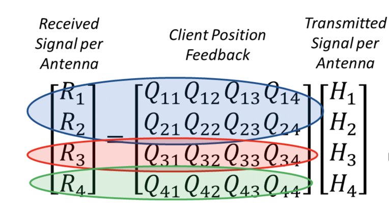

### WiFi notes

---

#### 802.11n

It standardlizes

* MIMO
* frame aggregation
* security improvement

#### MIMO

MIMO is a technology that uses multiple antennas to coherently resolve more information than possible using a single antenna.

it provides MIMO is through Spatial Division Multiplexing(SDM), which spatially multiplexes multiple independent data streams, transferred simultaneously within one spectral channel of bandwidth. MIMO SDM can significantly increase data throughput as the number of resolved spatial data streams is increased.  Each spatial stream requires a discrete antenna at both the transmitter and the receiver. In addition, MIMO technology requires a separate radio-frequency chain and analog-to-digital converter for each MIMO antenna, making it more expensive to implement than non-MIMO systems.

#### Data encoding 

 precoding 

* spatial beamforming -> improve signal quality.
* spatial coding -> increase data throughput via spatial multiplexing and increase range by exploiting the spatial diversity.

#### number of antennas

The number of simultaneous data streams is limited by the minimum number of antennas in use on both sides of the link. However, the individual radios often further limit the number of spatial streams that may carry unique data. 

The a x b : c notation helps identify what a given radio is capable of. 

* The first number (a) is the maximum number of transmit antennas or TX RF chains that can be used by the radio. 
* The second number (b) is the maximum number of receive antennas or RX RF chains that can be used by the radio. 
* The third number (c) is the maximum number of data spatial streams the radio can use. 

The 802.11n draft allows up to 4 x 4 : 4.

#### Frame aggregation

Two types of aggregation are defined:

* Aggregation of MAC [service data units](https://en.wikipedia.org/wiki/Service_data_unit) (MSDUs) at the top of the MAC (referred to as MSDU aggregation or A-MSDU)
* Aggregation of MAC [protocol data units](https://en.wikipedia.org/wiki/Protocol_data_unit) (MPDUs) at the bottom of the MAC (referred to as MPDU aggregation or A-MPDU)

Frame aggregation is a process of packing multiple MSDUs or MPDUs together to reduce the overheads and average them over multiple frames, thereby increasing the user level data rate. A-MPDU aggregation requires the use of [block acknowledgement](https://en.wikipedia.org/wiki/Block_acknowledgement) or BlockAck, which was introduced in 802.11e and has been optimized in 802.11n.

---

#### 802.11ac

New improvements

* Optional 160 MHz and mandatory 80 MHz channel bandwidth for stations;
* Support for up to eight spatial streams
* Downlink multi-user MIMO 
  * Multiple [STAs](https://en.wikipedia.org/wiki/Station_(computer_networking)), each with one or more antennas, transmit or receive independent data streams simultaneously
  * Downlink MU-MIMO (one transmitting device, multiple receiving devices) included as an optional mode.
* Modulation
  * 256-QAM,  rate 3/4 and 5/6, added as optional modesq
* other features
  * [Beamforming](https://en.wikipedia.org/wiki/Beamforming) with standardized sounding and feedback for compatibility between vendors
  * Coexistence mechanisms for 20, 40, 80, and 160 MHz channels

#### More on MIMO

The receiver can estimate H(using some channel information), and can use received Y to recovfer X.
$$
Y=HX
$$
However, it is a little bit different for MUMIMO in WiFi scenario, 

The overall process for MU-MIMO is as follows:

1. The AP broadcasts a sounding frame
2. Each MU-MIMO compatible client device transmits back matrix data(Received Signal per antena) to the access point.
3. The AP computes the relative position(Q) of each associated MU-MIMO compatible client device.
4. The AP selects a group of client devices for simultaneous communication
5. The AP computes the necessary phase offsets for each data stream to each client in the group and transmits all of the data streams in the client group
6. The AP sends a *BlockAckRequest* to each client device in the group separately to get confirmation as to whether the client device received the data
7. The AP receives a *BlockAck* from each client device in the group that successfully received data

reference:

* https://zhuanlan.zhihu.com/p/54278752

* https://www.zhihu.com/question/308217541

* https://en.wikipedia.org/wiki/IEEE_802.11

  