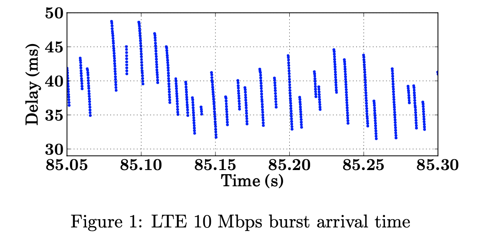
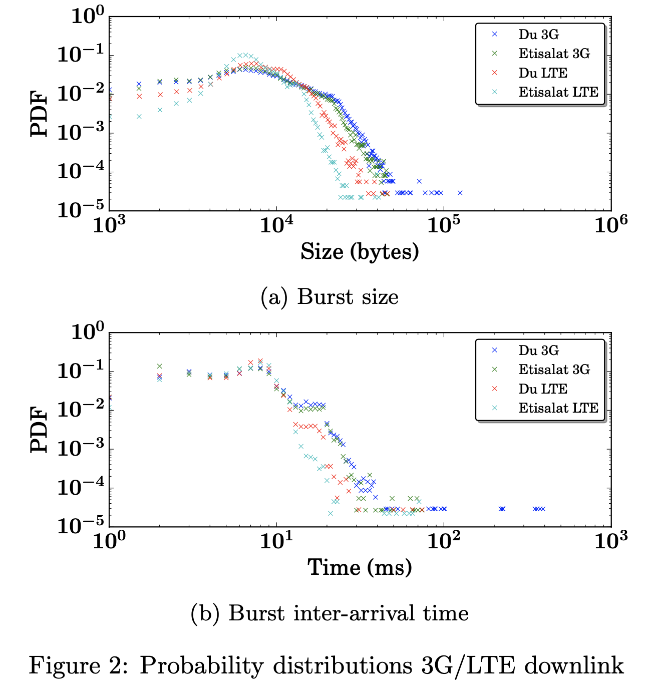
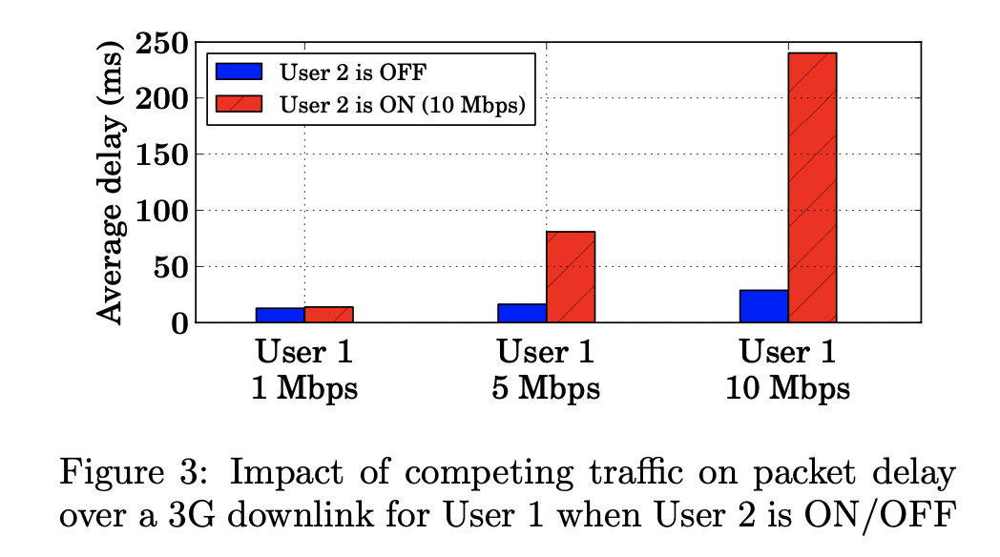
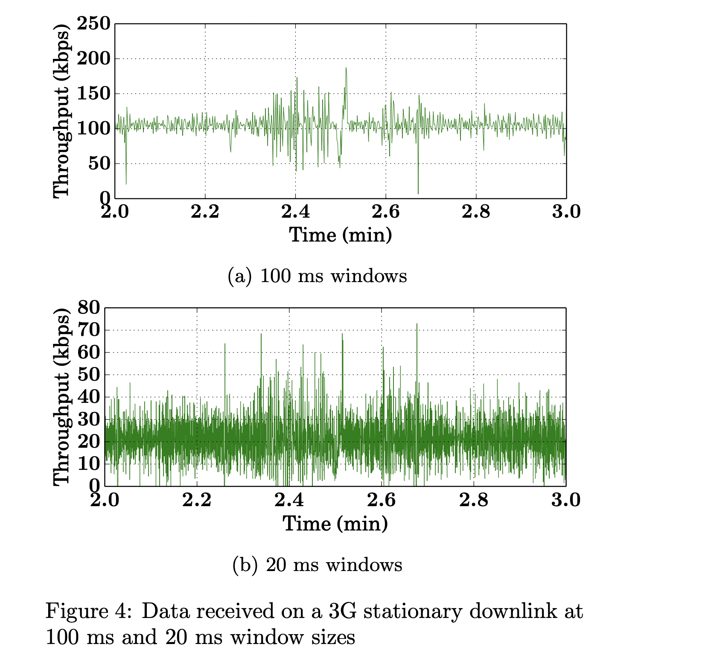

### Paper notes for wireless measurement

[Sigcomm2015] **Large-scale Measurements of Wireless Network Behavior**

This paper studies an anonymized subset of measurements, containing data from approximately ten thousand radio access points, tens of thousands of links, and 5.6 million clients from one-week periods in January 2014 and January 2015 to provide a deeper understanding of real- world network behavior

observes the following phenomena:

* wireless network usage continues to grow quickly
* Most access points see 2.4 GHz chan- nel utilization of 20% or more, with the top decile seeing greater than 50%, and the majority of the channel use con- tains decodable 802.11 headers.

* 具体数据主要看论文图表，没有什么特别的insight。

[Sigcomm2015]**Adaptive Congestion Control for Unpredictable Cellular Networks**

Legacy CC are known to perform poorly over cellular network due to(**mesurement summary**) 

* highly variable capacities over short time scales, 
* self-inflicted packet delays
* and packet losses unrelated to congestion.

To cope with these challenges, we present Verus, an end-to-end congestion control proto- col that uses delay measurements to react quickly to the capacity changes in cellular networks without explicitly attempting to predict the cellular channel dynamics. 

The key idea of Verus is to 

* continuously learn a delay profile that captures the relationship between end-to-end packet delay and outstanding window size over short epochs, 
* uses this relationship to incre- ment or decrement the window size based on the ob- served short-term packet delay variations

Verus achieves an order of magnitude (> 10x) reduction in delay.

**Some measurement results**:

cellular performance:

* Cellular networks tend to over-dimension their buffers by using large buffers at base stations to smooth the overall flow of traffic. As a result, conventional congestion control protocols result in “buffer-bloats”.
* there are significant performance differences across carriers, access technologies, geographic regions and time.
* TCP connections over LTE have various inefficiencies such as slow start.
* many TCP connections (∼52%) under-utilize the available bandwidth of LTE

Channel unpredictability

* physical properties of radio(path-loss&slow fading) causes changes in link performance despite mitigation techniques. 

* Three specific observations :

  * burst scheduling 
  * Competing traffic
  * Channel unpredictability

* measurement setup

  * The measurements were conducted on two commercial cellular networks, Du and Etisalat1, for both downlink and uplink direction. Our measurement setup consisted of **a standard rack server** and a client laptop tethered to a Sony Xpe- ria Z1 LTE mobile phone.
  * We implemented a measurement tool that sends/receives UDP packets between the server and client at 0.4 ms sending intervals. We performed clock synchronization, tagged packets with se- quence numbers, and included the sender timestamp to calculate the one-way delay at the receiver.

* Burst Scheduling

  * The radio scheduler serves users at different one millisecond Transmission Time Intervals (TTI) and the amount of data sent during the serving TTI is determined by radio conditions that lead to sending a burst of several packets. Figure 1 illustrates this phenomenon for one of our LTE 10 Mbps downlink measurements.

    

  * Figure 2 summarizes our findings on burst scheduling for the two operators on 3G and LTE. our client was stationary and in an urban residential area. Burst size and inter-burst arrival time are difficult to predict and vary widely over the course of the 5 minute trace de- spite low contention and mobility.

    

* Competing traffic

  * consider two users competing at the same cellular base station such that when both users are active, their combined data rates are almost equal to the 3G channel capacity. The first user is constantly receiving at a fixed rate (1, 5, 10 Mbps) while the sec- ond user is set to operate in ON/OFF periods of one minute intervals receiving at 10 Mbps

  * Figure 3 shows the packet delays for the first user when the second user is ON/OFF. We observe that during the non-competing periods the average delay is low, but when the second user is ON the average packet delay for the second user increases, especially when the combined data rate ap- proaches the channel capacity

    

* Channel Unpredictability

  * Figure 4: 3G downlink stationary node: throughput measurement. Even at 100 ms windows there are dramatic fluctuations in throughput due to burst scheduling.

    

  * simple predicators(linear predicator and k-step ahead predicator) fail to track the high variations of channel.  Standard prediction mechanisms are far from capturing the bursty behavior of the channel